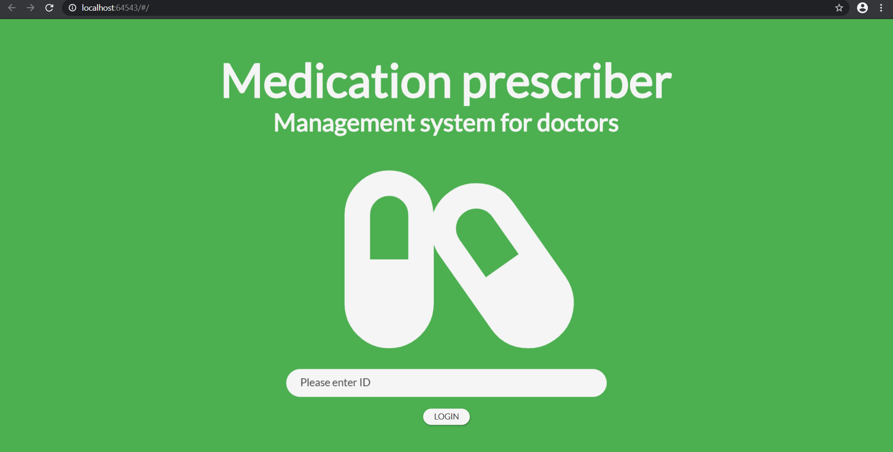
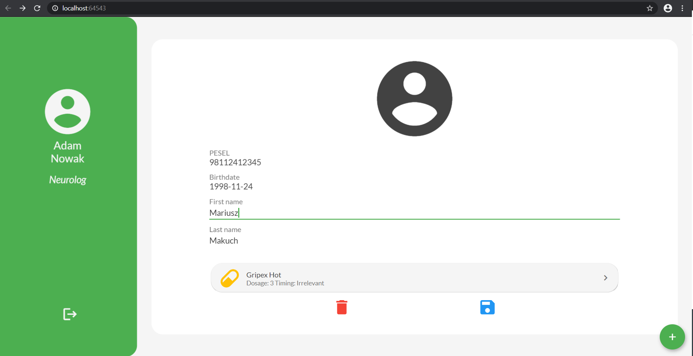
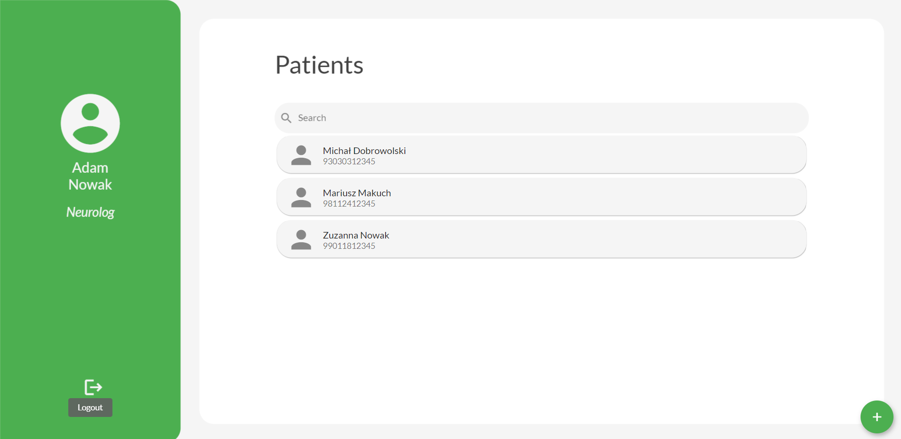
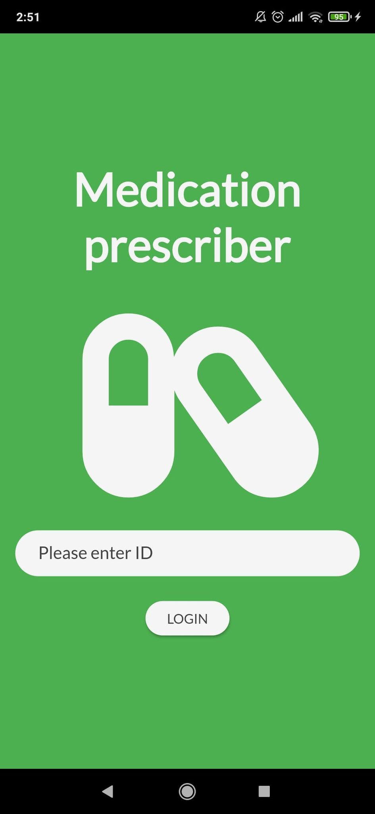
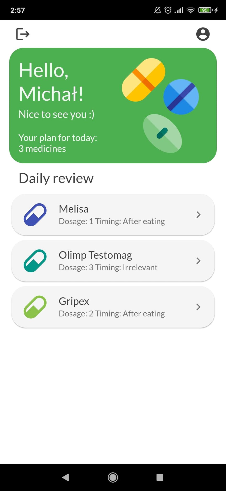
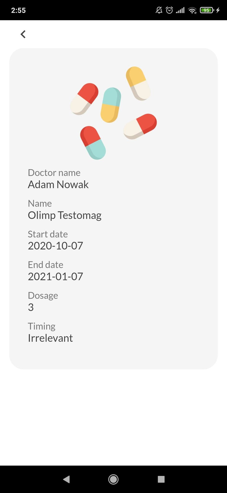

# Medication Prescription System

The project aims to create two applications for healthcare - mobile and web. They are designed to improve communication between the doctor and the patient in the matter of prescribing medications and recommendations, as well as generating reminders for the patient in the form of a list of medications that he should take on a given day.

## Authors

- [Kinga Marek](https://github.com/Astenna)
- [Mariusz Makuch](https://github.com/makruhz)
- [Mariusz Wiśniewski](https://github.com/Nexer8)

## Installation Guide

### Local Build

#### Prerequisites

- [Flutter 2.0.0](https://docs.flutter.dev/development/tools/sdk/releases)
- [Google Chrome](https://www.google.com/chrome/)
<!-- TODO: Add .Net version -->

#### Backend

<!-- TODO: To complete -->

#### Frontend

All the commands listed below have to be executed inside `frontend/` directory.

##### Web

```bash
# To build the web application
flutter build web
```

```bash
# To run the web application
flutter run -d chrome
```

##### Mobile

```bash
# To build the .apk file
flutter build apk
```

```bash
# To run the mobile application
flutter run -d emulator-<emulator_id>
```

### Docker

```bash
docker-compose up -d --build
```

#### Usage

The frontend docker container is configured to work on port 1337.

## Screenshots

### Web

|  |
| --- |
|  |
|  |

### Mobile

<!-- Insert image inside a 1x3 table -->

|  | |  |
| --- | --- | --- |
